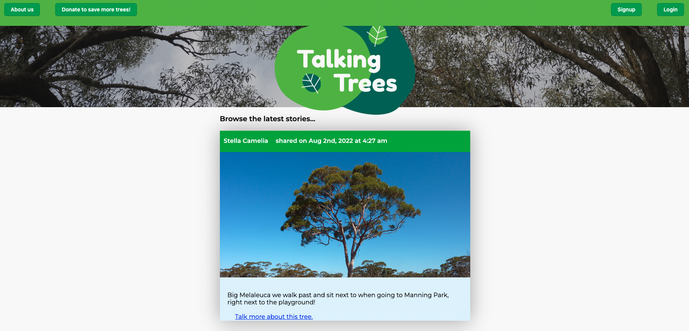

# Talking-Trees

## Description
Talking Trees is a web application designed to help users share their stories about trees which have been important to them, so as to build awareness and appreciation for established trees.
## Table of Contents
- [Instation Instructions](#installation-instructions)
- [Usage Instructions](#usage-instructions)
- [Repository Link](#repository-link)
- [Hosted Link](#hosted-link) 
- [References](#references)
- [License](#license)
- [Credits](#credits)
- [Questions](#questions)

## Installation Instructions
 1. Clone my repository to your local device
 2. Open in VS code
 3. Open the integrated terminal within the server.js location
 4. Enter "npm i" to install packages
 5. Enter "npm run seed" to seed the app
 6. Run "npm run develop" to initialise servers and start the app 

## Usage Instructions

Upon entry to TalkingTrees, you will be met with a page displaying posts by previous users. To interact, simply click 'login' or 'signup' and fill in the required fields to create your new account. Once you're in, you will be able to view individual stories, view a user's profile, post your own stories and add comments to any story!

## Repository Link

[Access the repo](https://github.com/kieranmichaelflynn/Talking-Trees.git)

## Hosted Link

[Jump straight to the deployed site!](https://talkingtrees.herokuapp.com/)

## License
This project is created under the MIT license

## Credits
This project was created by 
[kieranmichaelflynn](https://github.com/kieranmichaelflynn)

## Questions
To find out more information about this project feel free to reach out to me [here!](mailto:kieranmichaelflynn@gmail.com)

Thank you for reading, enjoy TalkingTrees!
